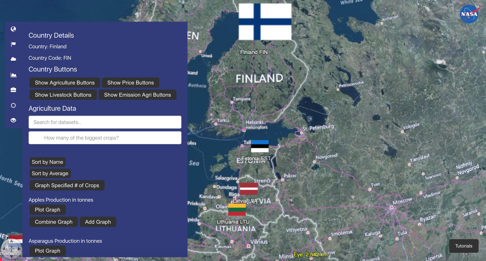

<p>in partnership with the <a href="http://www.esa.int" target="_blank">European Space Agency</a></p>

# NASA AgroSphere

### NASA World Wind is a free, open-source API that provides the tools to create interactive
visualizations of the world in 4D, such as satellite tracking and seismic history. The NASA
World Wind 2017 Intern team has designed an educational web app to visualize the effect of
climate change on agriculture by nation, using the Web World Wind Software Development Kit (SDK).

## Video Tutorial

<a href="https://www.youtube.com/watch?v=WMYI1UcgFr4">

</a>

## Introduction

The World Wind intern team utilized technologies including HTML5, CSS, and JavaScript to develop
 our application, incorporating and analyzing spatial data for agriculture and atmosphere.
 Data in various file formats are organized, analyzed and visualized on the globe. Users can
 click on the respective weather and nation placemarks for statistical data specific to that
 country’s history for atmosphere and agriculture, and for a specified timeframe. Users can
 also control each dataset on the globe by adjusting opacity, time, and other options, for
 comparing crop production versus climate. This web app is intended for use in the classrooms by
  teachers, science centers and home schoolers, as well as citizens of the world. Children and
  adults alike will be able to learn about climate issues by visually experiencing the data
  according to their interests. Users will learn about the effect of weather over time on
  agriculture, and impact to national economies, and more.

_Screenshot showing the available data for a selected country, which includes lists of crops,
price, livestocks, and agricultural emission._



_Screenshot comparing historical agricultural and weather data on a plot for USA._


_Screenshot showing AgroSphere comparing potato data from around the world._


## Features of AgroSphere

* Dynamically visualize various types of data, such as rainfall, crop production and prices, and more.
* Graph agricultural data from 1961 to 2014 and atmospheric data from 1989 to 2014, and view both simultaneously.
* Adjust time and opacity of layers displayed on the globe and thereby integrate layers to study groups of information together.
* National agricultural output can be examined closely and also compared to one another.
* Search for current weather data for many cities around the globe.
* Load in any number of spatiotemporal geographically accurate data from multiple sources, using a variety of formats including WMTS, WMS, KML, TIFF, and CSV.
* Use the Destination tool to immediately visit any desired location.

## Outreach

We discussed our web app and work in progress with Martin C. Heller from the Center for Sustainable Systems at University of Michigan. He offered us critiques from a researcher's point of view.

## How to Run and Develop AgroSphere Locally

Start by cloning the repository to your local system. You can do this through the terminal by using the ```git``` command, as outlined below.

```
git clone https://github.com/WorldWind-2017/AgroSphere.git
```

The above code should clone the repository to a folder called AgroSphere. To navigate to the main folder specific to AgroSphere, you can use the command outlined below.

```
cd AgroSphere/main
```

The main heart of the Javascript functions associated with AgroSphere are contained within the ```index.js``` file in the main folder. One example of editing this file is through the program vim, which can be used through the following command.

```
vim index.js
```


***

**Organization:** NASA Ames Research Center

**Manager:** <a href="https://www.linkedin.com/in/phogan">Patrick Hogan</a>

**Authors:** John Nguyen, Mingda Tang, Stacey Chen, Atreya Iyer, Nick Rubel


