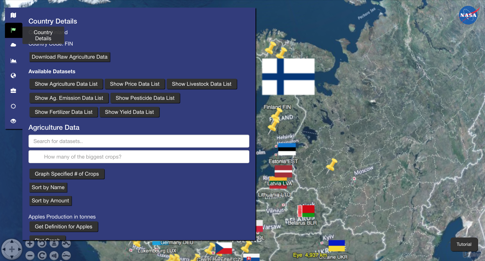
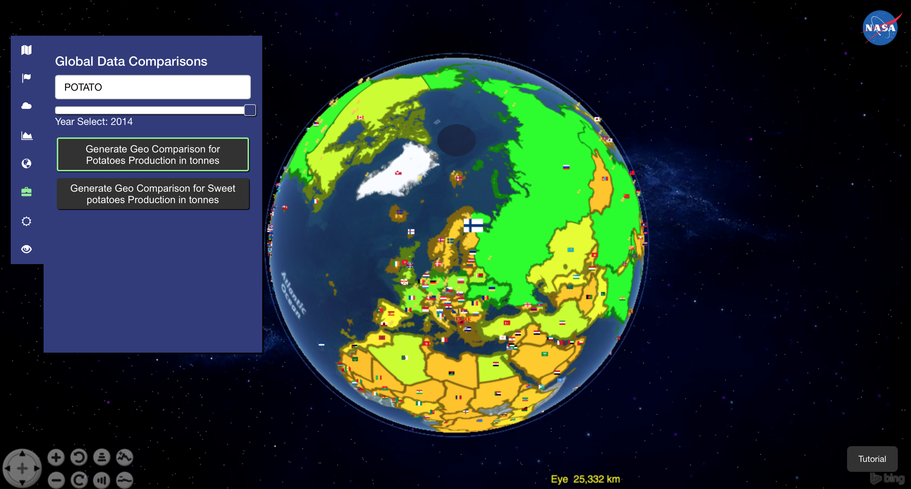
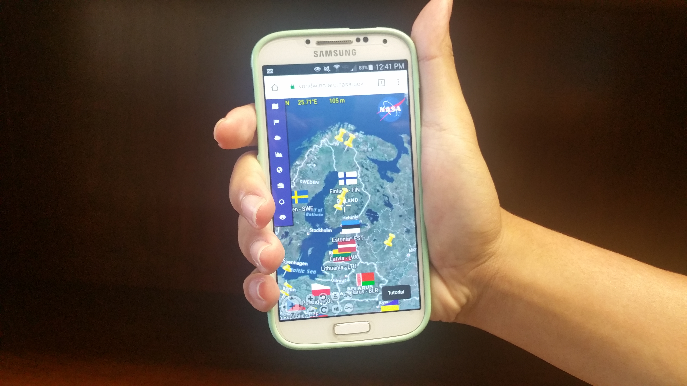
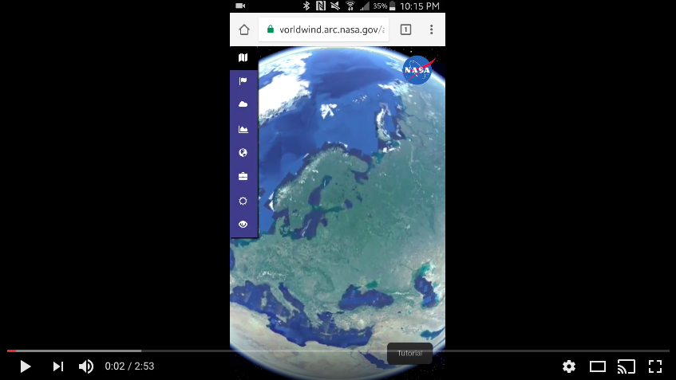

# <a href="https://worldwind.arc.nasa.gov/agrosphere/">AgroSphere</a>
## <a href="https://worldwind.arc.nasa.gov/agrosphere/about.html">Link to Our Website</a>

### NASA World Wind is a free, open-source API that provides the tools to create interactive - 

visualizations of the world in 4D, such as satellite tracking and seismic history. The NASA
World Wind 2017 Intern team has designed an educational web app that visualizes the effects of
climate change on agriculture using a large collection of global agriculture and climate data and the Web World Wind Software Development Kit (SDK).

## Video Tutorial

## Introduction

The World Wind intern team utilized technologies including HTML5, CSS, and JavaScript to develop our application, incorporating and analyzing spatial data for agriculture and atmosphere. Data in various file formats are organized, analyzed and visualized on the globe. Users can click on the respective weather and nation placemarks for statistical information. This includes details specific to that country’s history for atmosphere and agriculture and for a specified timeframe. Users can also control each dataset on the globe by adjusting opacity, time and other options for comparing crop production versus climate. This web app is intended for use in classrooms by teachers and students, as well as citizens of the world. Children and adults alike will be able to learn about climate issues by visually experiencing the data according to their interests. Users will learn about the effects of weather over time on agriculture, the impact to national economies and much more.

_Screenshot showing the available data for a selected country, which includes lists of crop production and yield,
prices, livestocks, agricultural emission, fertilizer and pesticides._

_Screenshot comparing historical agricultural and weather data on a plot for Finland._

_Screenshot showing Geo-Comparison potato production data displayed from multiple countries around the world._

## Lesson Plan

For a guide on how this app may be used in the classroom, click the button below. This lesson plan focuses on the use of the app in a larger unit on climate change. It is based on 90-minute classes.
<a href="AgroSphere_LessonPlan.pdf" target="_blank">Link to the Lesson Plan</a>
                    
## Features of AgroSphere

* Dynamically visualize various types of agriculture and climate data, such as rainfall, crop production and prices, and much more, from hundreds of countries across the globe.
* Graph agriculture data from 1961-2014 and climate data from 1989-2014 to view them simultaneously.
* Adjust time and opacity of image layers displayed on the globe and compare the given visual data with plotted agriculture and climate data.
* Explore the Geo-Comparison Agriculture data visualized on the globe for hundreds crop production datasets. Juxtapose data between any number of colors using a simple color scheme legend created using standard deviation formulas.
* Search for current weather data for any city around the globe. Results include temperature, sunrise/sunset, 
* Load in any number of spatiotemporal geographically-accurate data from multiple sources, using data formats such as GeoJSON, WMS, and CSV.
* Use the location Search tool in the View Options tab to immediately visit any desired location.
* This web application is fully functional on mobile devices (smartphones and tablets).

## Mobile Demo

This is AgroSphere running on mobile. All of the functionalities of the app are available in your hands!

## Outreach

We discussed our web app and work-in-progress with Martin C. Heller from the Center for Sustainable Systems at University of Michigan. He offered us critiques from a researcher's point of view.
We also tested our app on NASA interns from the STEM Teacher and Researcher (STAR) program to receive suggestions from an educational perspective.
Finally, we showcased our app to professional web app developers from institutions such as the University of Pennsylvania.

## How to Run and Develop AgroSphere

1) Visit http://worldwind.arc.nasa.gov/AgroSphere to use the app on your webpage.
2) Download or clone the repository in to local storage and run the index.html in a webserver using WebStorm, which has a built in webserver (https://blog.jetbrains.com/webstorm/2013/03/built-in-server-in-webstorm-6/), or by using MAMP (https://www.mamp.info/en/), a free, local server environment.

## Future Directions

You are welcome to add more climate and agriculture data using our built-in CSV reading functionality and the WebWorldWind Placemarks feature. For example, drought and flood data can be added and displayed on our app to examine how agriculture has been affected by those particular disasters.

#### Updated as of 8/3/17

***

**Organization:** NASA Ames Research Center

**Manager:** <a href="https://www.linkedin.com/in/phogan">Patrick Hogan</a>

**Authors:** John Nguyen, <a href="https://mdtang.github.io/">Mingda Tang</a>, Stacey Chen, Atreya Iyer, Nick Rubel

